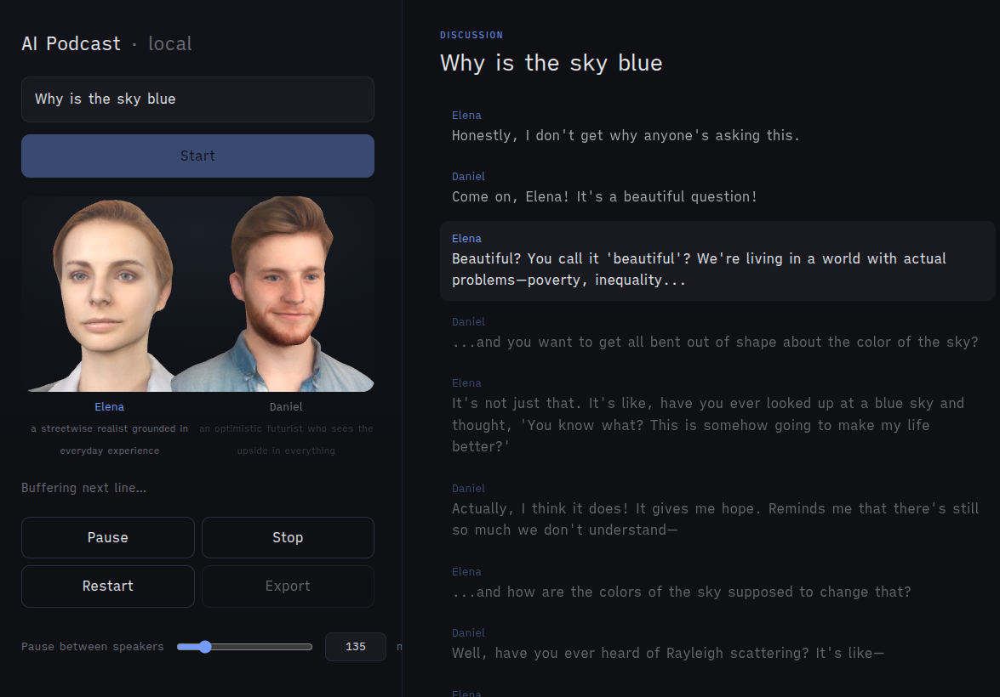

# AI Podcast



Local-first AI podcast generator. Enter a topic and it writes a natural two-person
discussion with a local LLM, voices each speaker with distinct TTS, and plays it
back as audio with lip-synced 3D faces and a live transcript.

Everything runs locally — no cloud, no API keys.

- **Script**: [Ollama](https://ollama.com) (`llama3.1:8b`)
- **Voices**: [Chatterbox TTS](https://github.com/resemble-ai/chatterbox) (GPU), with
  distinct speaker voices seeded once from [Kokoro](https://github.com/hexgrad/kokoro)
- **Playback / controls / export**: the browser (no frontend build step)

## Features

- Topic + 1–4 speakers, each given a random persona/viewpoint
- Live progress while it writes and voices the conversation
- Per-line emotion → expressive delivery; natural pauses between turns
- Play / pause / resume / stop / restart with a transcript that highlights as it plays
- Export the finished episode as an `.mp3` (with a light "recorded" mic chain)

## Requirements

- Python 3.12+, `ffmpeg`
- [Ollama](https://ollama.com) running, with the model pulled: `ollama pull llama3.1:8b`
- An NVIDIA GPU is recommended for Chatterbox (tested on an RTX 3060 12GB)

## Setup

```bash
python3 -m venv .venv
.venv/bin/pip install -r requirements.txt
.venv/bin/python app.py        # → http://localhost:5000
```

First run downloads the Chatterbox + Kokoro models (one-time, needs internet).

### Lip-sync (optional but recommended)

For phoneme-accurate mouth shapes, install [Rhubarb Lip Sync](https://github.com/DanielSWolf/rhubarb-lip-sync)
into `bin/` (any subfolder; the app finds `bin/*/rhubarb`):

```bash
mkdir -p bin && cd bin
curl -L -o r.zip https://github.com/DanielSWolf/rhubarb-lip-sync/releases/download/v1.13.0/Rhubarb-Lip-Sync-1.13.0-Linux.zip
unzip r.zip && rm r.zip && chmod +x Rhubarb-Lip-Sync-*/rhubarb
```

Without it, the faces fall back to amplitude-driven jaw movement. Requires `ffmpeg` (already a dependency).

## Notes

- Want specific voices? Drop your own 5–10s `.wav` into `/tmp/ai-podcast/_refs/<voice>.wav`
  and Chatterbox will clone that instead of the Kokoro-seeded reference.
- Lighter/faster but less expressive? Switch `MODEL` to `llama3.2:3b` in `app.py`.
